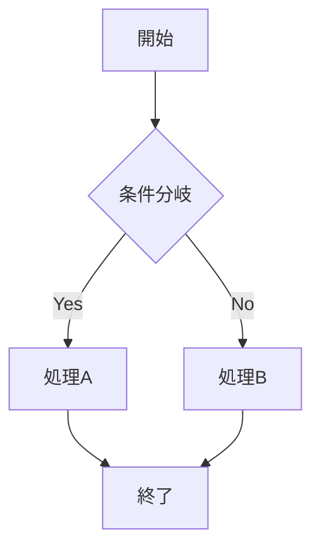

# Slidevの使い方

開発者向けプレゼンテーションツールの完全ガイド

<div class="pt-12">
  <span @click="$slidev.nav.next" class="px-2 py-1 rounded cursor-pointer" hover="bg-white bg-opacity-10">
    スライドを開始 →
  </span>
</div>

---

# Slidevとは？

<div v-click>

- 📝 **Markdown** で書けるスライド

</div>
<div v-click>

- 🎨 **テーマ** とレイアウトが豊富  

</div>
<div v-click>

- 🧑‍💻 **開発者向け** の機能が充実

</div>
<div v-click>

- 🤹 **インタラクティブ** な要素

</div>
<div v-click>

- 🎥 **録画・エクスポート** 機能

</div>
<div v-click>

- ⚡ **ホットリロード** で快適な編集

</div>

---

# インストール

```bash
# NPMでグローバルインストール
npm install -g @slidev/cli

# 新しいプロジェクトを作成
npm init slidev@latest

# 開発サーバーを起動
slidev
```

---

# 基本的な書き方

```markdown
---
theme: default
---

# 最初のスライド

---

# 2番目のスライド
内容をここに書く

---

# 3番目のスライド
```

<div class="text-center text-sm opacity-75 mt-8">
スライドは `---` で区切ります
</div>

---

# レイアウト

## 主なレイアウト

<div class="grid grid-cols-3 gap-6 mt-8">

<div>
- `default` - 標準
- `center` - 中央寄せ</div>

<div>
- `cover` - カバー  
- `intro` - イントロ</div>

<div>
- `section` - セクション
- `quote` - 引用</div>

</div>

## 使用例
```yaml
---
layout: center
class: text-center
---
```

---

# コードハイライト

## 特定の行をハイライト

```js {2,3}
function hello() {
  console.log('Hello')  // ハイライト
  console.log('World')  // ハイライト
}
```

## 行ごとにアニメーション

```js {1|2-3|4}
function greet(name) {
  const message = `Hello, ${name}!`
  console.log(message)
  return message
}
```

---

# アニメーション

<div v-click>

- **v-clicks** でリストを順番に表示

</div>
<div v-click>

- クリックするたびに次の項目が表示される  

</div>
<div v-click>

- プレゼンテーションに動きを加える

</div>

<div v-click class="mt-12 text-center text-2xl text-red-400">
最後に表示される要素
</div>

---

# 図表とMermaid



<div class="text-sm opacity-75 mt-4">
Mermaidで図表を簡単に作成
</div>

---

# テーマ

<div class="grid grid-cols-2 gap-8">

<div>

## 人気のテーマ
- `default` - シンプル
- `seriph` - エレガント
- `apple-basic` - Apple風
- `bricks` - モダン

</div>

<div>

## 設定方法
```yaml
---
theme: seriph
---
```

</div>

</div>

---

# キーボードショートカット

<div class="text-lg">

- `Space` / `→` 次のスライド
- `←` 前のスライド  
- `f` フルスクリーン
- `o` スライド一覧
- `d` ダークモード
- `p` プレゼンターモード

</div>

---

# エクスポート機能

```bash
# PDF出力
slidev export

# PNGで各スライドを出力
slidev export --format png

# PPTXで出力
slidev export --format pptx
```

---

# プレゼンターモード

## 機能
- 現在のスライドと次のスライド表示
- ノート表示とタイマー機能
- スライド一覧

## 使い方
1. `p` キーでプレゼンターモード開始
2. 新しいウィンドウでノートを確認

<!--
これはプレゼンターノートです。
プレゼンターモードでのみ表示されます。
-->

---

# Tips

<div v-click>

- **画像**: `public/` フォルダに配置

</div>
<div v-click>

- **CSS**: カスタマイズ可能

</div>
<div v-click>

- **Vueコンポーネント**: 使用可能  

</div>
<div v-click>

- **LaTeX**: 数式記法サポート

</div>

```markdown
# 例

$E = mc^2$
<MyComponent />
```

---
layout: center
class: text-center
---

# ありがとうございました！

Slidevで素晴らしいプレゼンテーションを作成しましょう

[ドキュメント](https://sli.dev) · [GitHub](https://github.com/slidevjs/slidev) · [テーマ](https://sli.dev/themes/gallery.html)